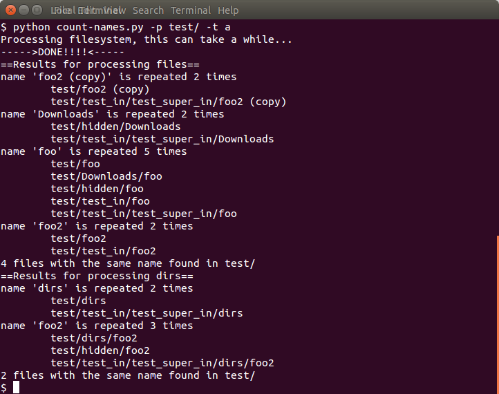

# count-names
A simple script for detecting repeated names within a directory (and all its subdirectories recursively) or the whole filesystem.

type `python count-names.py -h` to see the usage of the script

## Sample

